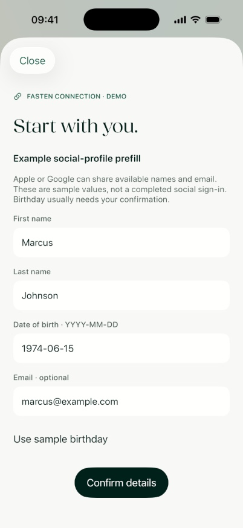
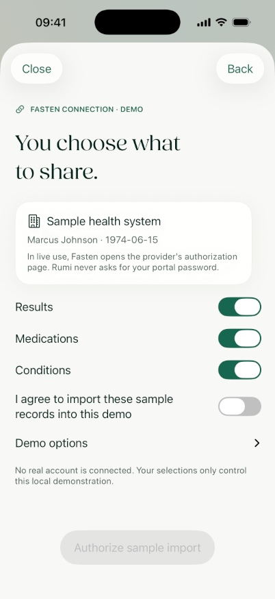
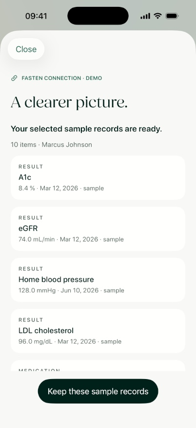
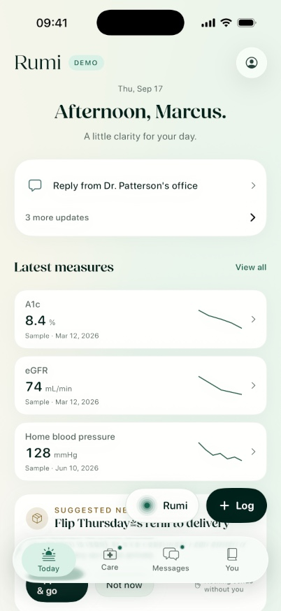
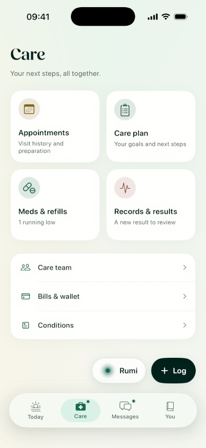
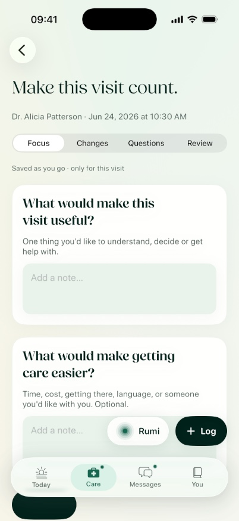
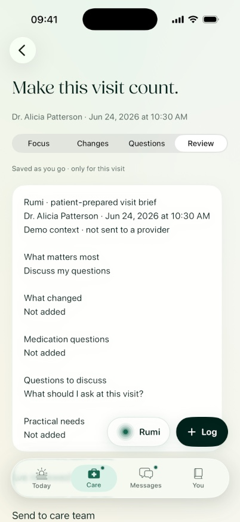
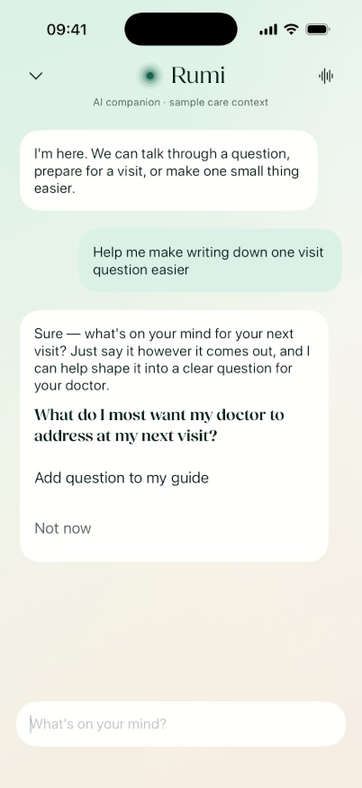
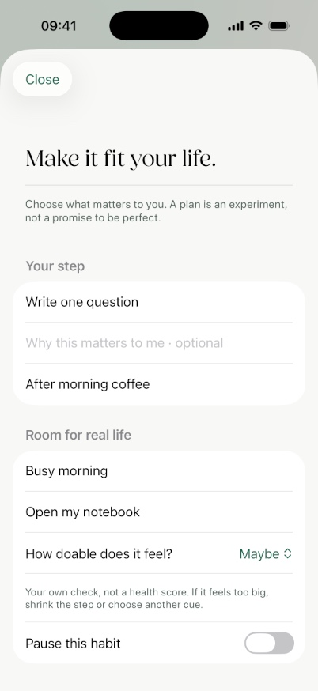
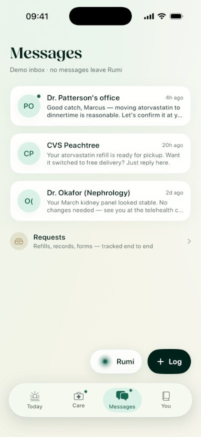

# Rumi — feature, journey and screen library

**Native iPhone edition · September 17, 2026**

An ordered reference for product walkthroughs, design review and presentations. Each journey names its feature, screens, patient actions and outcome. The separate [working document](RUMI_RESCOPE.md) owns implementation decisions; [functional requirements](RUMI_REQUIREMENTS.md) own expected behavior. This library describes the current native app unless a screen is explicitly marked planned or legacy. Web has not received this native refinement.

**Screenshot coverage:** ten primary screens have fresh original simulator captures and accepted branded presentation slides, refreshed after the Fields font correction. Originals are embedded beside the corresponding screens below; slide links provide the real-screen-plus-short-caption version. The full inventory includes additional screens and state variants whose captures remain explicitly pending. This is not an exhaustive screenshot pass. All captures use synthetic information; no live Fasten/EHR capability is implied.

## 1. First use — understand Rumi, choose a story, connect optionally

**Features:** Welcome Router; Select Care Pathway; Records Connection; preference setup.

**Journey:** Welcome → sample story → record connection or skip → preferences → Today. No chat is required. Existing users can preview the same journey without changing saved work.

### 1.01 Welcome
- **Shows:** Fields headline, small companion mark, three succinct care benefits, explicit demo entry and Sign in.
- **Patient action:** explore the demo or inspect sign-in availability.
- **Presentation note:** sign-in is not connected in this native build; do not present the button as working authentication.
- **Capture:** welcome, light and dark; screenshot pending.

### 1.02 Sign-in unavailable
- **Shows:** explanation that no account or medical connection has been created.
- **Patient action:** dismiss the notice and remain on Welcome.
- **Capture:** notice over Welcome; pending.

### 1.03 Sample-story selection
- **Shows:** Marcus/everyday care, Elena/treatment, Sam/procedure, Rosa/coordinated care.
- **Patient action:** choose one; Back preserves the local choice.
- **Outcome:** selects a coherent demonstration, not a real patient's identity.
- **Capture:** four selection variants; pending.

### 1.04 Records introduction
- **Shows:** Fasten Connect entry, optionality, local demonstration disclosure and a direct continue-without-connecting action.
- **Patient action:** try a connection or skip; after review, see the sample item count.
- **Capture:** before and after a sample import; pending.

### 1.05 Confirm profile details
- **Shows:** example social-profile name/email prefill; editable first name, last name, birthday and optional email. Birthday begins empty; a sample-birthday shortcut is explicit.
- **Patient action:** correct/confirm details; restore sample details after a mismatch.
- **Outcome:** confirms synthetic demonstration details only. Social profile data does not authorize clinical-record access.
- **Capture:** completed sample profile captured; empty/invalid/mismatching variants pending.

[Presentation slide: Confirm your details](screenshots/iphone/en/02_confirm_sample_profile.png)

### 1.06 Sharing and sample authorization
- **Shows:** selected sample person, sample health system, Results/Medications/Conditions choices, an unchecked consent control and a partial-import demo option.
- **Patient action:** choose at least one category and explicitly authorize the sample import.
- **Outcome:** only chosen categories enter the import demonstration. No native portal-password form.
- **Capture:** sharing screen captured; other scope/consent variants pending.

[Presentation slide: You choose what to share](screenshots/iphone/en/03_choose_sharing.png)

### 1.07 Import progress
- **Shows:** sample authorization, selected-record preparation and source/date checking.
- **Patient action:** close safely at any point.
- **Outcome:** simulates import locally; does not claim a Fasten network request.
- **Capture:** in-progress demonstration; pending.

### 1.08 Import review
- **Shows:** imported sample item count, names, values, dates where available, categories and local-demo provenance. Partial imports remain identified.
- **Patient action:** keep the reviewed sample snapshot or close without committing it.
- **Capture:** complete sample review captured; partial variant pending.

[Presentation slide: See the sample picture](screenshots/iphone/en/04_sample_import_review.png)

### 1.09 Preferences
- **Shows:** optional companion tone and background-music choice.
- **Patient action:** apply choices or skip without applying edited preferences.
- **Outcome:** enters Today; music defaults off for new users.
- **Capture:** preferences; pending.

### 1.10 Welcome preview
- **Shows:** the same journey with a visible Close action.
- **Entry:** Settings → Preview the welcome.
- **Outcome:** closing/completing does not change scenario, connection, preferences or saved work.
- **Capture:** preview header and return to original scenario; pending.

### 1.11 Real authorization — planned
- **Intended screens:** social sign-in → confirmed available profile claims → source selection → provider authorization or verified identity → import status → patient/source review.
- **Current boundary:** not available. Tenant Fasten access, server ownership checks, webhook ingestion and real-patient identity isolation are not yet connected.
- **Screenshot:** none; do not use demo images as production evidence.

## 2. Daily orientation — less to process, clear next steps

**Features:** Today; Thread; Needs You; Tracking Entry Point; companion access.

**Journey:** open Today → review relevant updates → enter the exact care task, log or conversation.

### 2.01 Today
- **Shows:** Fields greeting, date, Demo label, consolidated updates, sample metrics and up to three optional moments. Upcoming visit appears only when an actual stored appointment is in the future and not cancelled.
- **Patient action:** open a relevant item, Settings, Rumi or Log.
- **Capture:** normal sample day captured; quiet/upcoming-visit variants pending.

[Presentation slide: Your day, in focus](screenshots/iphone/en/01_today.png)

### 2.02 Consolidated updates
- **Shows:** highest relevant update and expandable remaining items; important context is not replaced by decorative content.
- **Patient action:** open the exact message, appointment, result or request.
- **Capture:** collapsed/expanded and empty absence; pending.

### 2.03 Metric detail entry
- **Shows:** actual sample-series values, units, dates and compact history.
- **Patient action:** open the selected result series, not the first series in a list.
- **Capture:** metric row and destination; pending.

### 2.04 Floating Rumi and Log
- **Shows:** labeled Rumi and Log controls above Today/Care/Messages/You navigation.
- **Patient action:** open conversation or logging with a thumb-reachable action on any main destination.
- **Outcome:** direct care navigation remains separate from companion conversation.
- **Capture:** visible in the captured Today and Care/preparation screens in this library.

### 2.05 Thread moments
- **Shows:** insight, habit, task or check-in content; up to three items, with no empty filler.
- **Patient action:** open the related workspace or dismiss. Habit actions now open Journeys rather than completing an unrelated first habit.
- **Capture:** each moment type and dismissal; pending.

## 3. Records and results — inspect the evidence

**Features:** longitudinal record; Labs; Vitals; Conditions; Immunizations; Medications; Procedures; Notes; Documents; Records Connection.

**Journey:** Care → Records & results → category or Fasten import → exact item → explanation/question.

### 3.01 Care hub
- **Shows:** Appointments, Care plan, Meds & refills, Records & results; grouped contextual care links.
- **Patient action:** open the task workspace directly.
- **Capture:** four-tile hub captured.

[Presentation slide: Care, clearly organized](screenshots/iphone/en/05_care_hub.png)

### 3.02 Records browser
- **Shows:** category grid, documents link, sample sources and Fasten connection card.
- **Patient action:** choose a category, inspect sources or demonstrate a connection.
- **Capture:** records overview; pending.

### 3.03 Fasten source and import card
- **Shows:** not connected, sample import ready, partial sample import, or real-connection unavailable notice. Expanded rows show the retained import snapshot.
- **Patient action:** review sample items, try again or remove this import without deleting unrelated history.
- **Capture:** empty/complete/partial/expanded/unavailable; pending.

### 3.04 Record category
- **Shows:** selected category rows with source/date and explanation entry.
- **Variants:** Labs, Medications, Conditions, Immunizations, Procedures, Notes, Documents.
- **Patient action:** select an exact item or inspect a conflict.
- **Capture:** each category; pending.

### 3.05 Lab or vital series detail
- **Shows:** selected metric history, values/units, source and explanatory context.
- **Patient action:** inspect history and open explanation.
- **Capture:** glucose/A1c, blood pressure and other available scenario series; pending.

### 3.06 Result explanation
- **Shows:** reading explanation, possible next discussion and question framing for the selected series.
- **Patient action:** return to evidence or bring a question into care preparation.
- **Boundary:** fixture explanation is not a newly verified clinical interpretation.
- **Capture:** explanation sheet; pending.

### 3.07 Record conflict
- **Shows:** conflicting source details and a care-team question route.
- **Boundary:** legacy mock contact behavior is not verified delivery and must not be described as such in presentations.
- **Capture:** disagreement state; pending.

### 3.08 Conditions overview
- **Shows:** the selected sample person's condition context and care-plan links.
- **Patient action:** explore connected aspects of care without treating a pathway as a new identity.
- **Capture:** single- and multi-condition scenarios; pending.

### 3.09 Full longitudinal reconciliation — planned
- **Intended screens:** attributed record detail, corrected-version history, ambiguous patient association, pending/no-record import, revoked access and supported reconnect.
- **Boundary:** current sample category browser is not full clinical reconciliation. Allergy-specific completeness and new source categories remain open delivery work.

## 4. The visit cycle — prepare, review, bring it with you

**Features:** Appointments Mgmt; Providers; Discussion Guide; AI visit preparation; recipient reports; Virtual Visits.

**Journey:** appointment list → exact appointment → Focus → Changes → Questions → Review → export. EHR submission remains unavailable.

### 4.01 Appointments
- **Shows:** stored visits and status, date, location and visit type.
- **Patient action:** select a visit.
- **Capture:** in-person/virtual/pending/cancelled/empty; pending.

### 4.02 Appointment detail
- **Shows:** selected provider, time, location, goal context, supported logistics and preparation entry.
- **Patient action:** prepare even when no brief exists yet; inspect rescheduling or visit access.
- **Capture:** two different appointments to prove context separation; pending.

### 4.03 Reschedule review
- **Shows:** local demonstration date choice and confirmation UI.
- **Outcome:** stores the demo change; clears stale trip details and invalidates the affected prep review. It is not an office-confirmed reschedule.
- **Capture:** current and proposed dates; pending.

### 4.04 Trip or virtual readiness
- **Shows:** location/departure/checklist where provided; virtual join eligibility where provided.
- **Patient action:** review the selected visit's logistics.
- **Boundary:** route/ride/calendar and video destinations have not been verified as live services.
- **Capture:** in-person trip and virtual readiness; pending.

### 4.05 Prep — Focus
- **Shows:** exact visit, four-step control, priority and practical-needs notes.
- **Patient action:** state what would make the visit useful; mention cost, timing, access, language or support needs optionally.
- **Outcome:** draft saved only to this appointment.
- **Capture:** Focus captured; populated priority appears in Review below.

[Presentation slide: Start with what matters](screenshots/iphone/en/06_visit_preparation_focus.png)

### 4.06 Prep — Changes
- **Shows:** changes/symptoms and medication-concern fields.
- **Patient action:** record their own observations; optional and editable.
- **Outcome:** patient-authored data, not a clinician note or medication instruction.
- **Capture:** changes and concerns; pending.

### 4.07 Prep — Questions
- **Shows:** editable ordered questions, explicit selection from the general Guide, optional Rumi drafting.
- **Patient action:** place the most important question first or request AI suggestions after processing disclosure.
- **Capture:** handwritten questions and guide chooser; pending.

### 4.08 Prep — AI suggestions
- **Shows:** separate draft suggestions, Stop while generating, Add/Not for me after completion, recoverable error.
- **Patient action:** inspect and choose whether to add the suggestions. Nothing silently joins the brief.
- **Capture:** consent, generation, successful suggestions and error; pending.

### 4.09 Prep — Review
- **Shows:** complete patient-authored brief, selected visit, exact text and review state.
- **Patient action:** confirm the current version; revisit any field to edit.
- **Outcome:** changed content requires a new review. No provider receipt is implied.
- **Capture:** populated review captured; reviewed/edited-again variants pending.

[Presentation slide: Review before sharing](screenshots/iphone/en/07_visit_preparation_review.png)

### 4.10 Reviewed export and delivery limit
- **Shows:** native share sheet for the reviewed text; separate EHR-unavailable notice.
- **Patient action:** export a copy themselves or retain it in the app.
- **Outcome:** exporting is not sending, acceptance, clinician authorship or review.
- **Capture:** export control and unavailable notice; pending.

### 4.11 Discussion guide
- **Shows:** general questions and observations, add/edit/remove/covered controls.
- **Patient action:** maintain unassigned discussion items; explicitly choose items for a particular prep.
- **Capture:** empty/populated/covered; pending.

### 4.12 Care team
- **Shows:** sample clinicians and their organizations, visit entries and guide access.
- **Patient action:** choose the relevant visit or contact route.
- **Boundary:** sample telephone/provider data are not validated real care contacts.
- **Capture:** care-team list; pending.

### 4.13 Recipient reports
- **Shows:** existing report range/provider variants and report review.
- **Boundary:** legacy report sending remains simulated; the new reviewed visit brief must not be confused with that older delivery claim.
- **Capture:** report list and detail, labeled legacy demo; pending.

### 4.14 Post-visit follow-up — planned
- **Intended screens:** recorded answers, approved care-plan updates, linked in-app reminders, follow-up message and verified brief-delivery states.
- **Boundary:** full linked post-visit automation is not complete.

## 5. Rumi conversation — usable now, ready for a transport handoff

**Features:** AI Companion; contextual conversation; voice; editable action proposals.

**Journey:** floating Rumi → text/voice → response → optional draft/habit/question review → return to the original task.

### 5.01 Text conversation
- **Shows:** readable native message surfaces, sample/AI context, multiline composer and close/voice controls.
- **Patient action:** ask a question, send another thought or leave a draft.
- **Outcome:** completed history and unsent composer persist per scenario. Close hides chat; Stop ends generation.
- **Capture:** actual text exchange captured, with the AI's completed reply. Additional history/keyboard/error variants pending.

[Presentation slide: Room to talk it through](screenshots/iphone/en/09_rumi_conversation.png)

### 5.02 Reply generation
- **Shows:** progress before content, incoming text, explicit Stop; internal action tags remain hidden.
- **Patient action:** stop or send a newer message.
- **Outcome:** old responses cannot overwrite a newer request; incomplete content cannot execute a proposal.
- **Capture:** thinking/streaming; pending.

### 5.03 Interrupted or failed reply
- **Shows:** incomplete/unavailable notice beside retained text and eligible retry.
- **Patient action:** retry the associated message, keep working elsewhere, or return later.
- **Outcome:** no fabricated offline clinical reply; retry does not duplicate the patient message.
- **Capture:** stopped, network error and restored partial reply; pending.

### 5.04 Drafted guide question
- **Shows:** AI-proposed question with explicit Add and Not now.
- **Outcome:** only Add writes it to the guide; decline does not look like completion.
- **Capture:** proposed/added/declined; pending.

### 5.05 Habit proposal
- **Shows:** suggested tiny action and cue, Make it my own and Not now.
- **Patient action:** opens editable habit planning rather than completing an unrelated habit.
- **Capture:** proposal and chosen/declined state; pending.

### 5.06 External-action draft
- **Shows:** draft title, nothing-sent status and review entry for a refill/question/action.
- **Patient action:** inspect exact wording and recipient before saving.
- **Capture:** draft card and saved draft; pending.

### 5.07 Voice
- **Shows:** distinct idle/listening/transcribing/thinking/speaking/unavailable states; text fallback.
- **Outcome:** a completed response returns to shared text history. Audio backend/device behavior needs dedicated end-to-end validation.
- **Capture:** each state, including denied microphone; pending.

## 6. Habits and behavioral support — adapt the plan, not the person

**Features:** Atomic Habits & Journeys; barrier-aware support; self-reported feedback.

**Journey:** Journeys → existing habit or Shape a small step → reason/cue/barrier/fallback → choose → check in → revise or pause.

### 6.01 Journeys
- **Shows:** existing journey themes, light garden, held memories and a direct small-step entry.
- **Patient action:** open a habit by its title or create a new step.
- **Capture:** populated and quiet state; pending.

### 6.02 Shape a small step
- **Shows:** tiny action, personal reason and everyday cue fields.
- **Patient action:** make an intentional choice; no auto-commitment from chat or demographics.
- **Capture:** populated new plan captured; AI-prefilled/accepted variants pending.

[Presentation slide: A step that fits](screenshots/iphone/en/08_small_step_plan.png)

### 6.03 Room for real life
- **Shows:** obstacle, smaller fallback, optional self-rated doability and Pause.
- **Patient action:** change the method to fit their life; no personality scoring or clinical threshold.
- **Capture:** barrier/fallback and paused variants; pending.

### 6.04 Daily check-in
- **Shows:** Did my step; Did the smaller version; Something got in the way; Not today; optional reflection.
- **Patient action:** report one outcome and optionally explain what happened.
- **Outcome:** one editable daily check-in for the selected habit. Accepting a plan is not a completed action.
- **Capture:** each outcome; pending.

### 6.05 Review and undo
- **Shows:** recent dated check-ins and an undo action for today.
- **Patient action:** correct an accidental entry, keep the plan, or adapt it.
- **Outcome:** setbacks receive nonjudgmental copy; smaller versions count without inflating duplicates.
- **Capture:** history, corrected outcome and undo; pending.

### 6.06 Deeper behavioral profile — planned
- **Intended experience:** explicit engagement pace, attributable editable memories, goal-specific learning from confirmed action and patient feedback, optional quiet outreach.
- **Boundary:** the supplied 92-factor catalog and separate backend are context, not a completed native psychological-profile engine. Hidden trait inference, numerical scoring and reinforcement learning are not active in this build.

### 6.07 Programs and sponsorship
- **Shows:** retained program cards, clinical/personal fit and sponsor explanation.
- **Patient action:** inspect or decline support without losing ordinary care access.
- **Boundary:** current enrollment/eligibility are prototype behavior, not verified sponsored-service access.
- **Capture:** offered/enrolled/declined and sponsor sheet; pending.

## 7. Messages and agents — keep the patient in control

**Features:** Messaging; Agentic Action Cards; Agent Network; requests.

**Journey:** Messages or contextual proposal → exact draft/recipient review → saved local draft or explicitly simulated thread → visible status.

### 7.01 Messages inbox
- **Shows:** dedicated care-team conversations with demo/portal distinctions and unread state.
- **Patient action:** open the selected thread or requests.
- **Capture:** populated demo inbox captured; empty and other unread variants pending.

[Presentation slide: Keep the thread together](screenshots/iphone/en/10_messages.png)

### 7.02 Message thread
- **Shows:** selected recipient/history and persistent reply draft.
- **Patient action:** reply in the demo or keep a portal draft; do not assume a portal handoff is sent.
- **Capture:** demo thread and portal draft; pending.

### 7.03 Requests list and composer
- **Shows:** refill, appointment, record or form request choices and local status.
- **Boundary:** existing request submission is not verified external delivery; complete attachment/new-message workflows remain pending.
- **Capture:** list and each request type; pending.

### 7.04 Workflow review
- **Shows:** exact editable draft, required intended recipient, no-fees/no-delivery disclosure and Save reviewed draft / Save for later / Decline.
- **Patient action:** review the actual content. Editing invalidates prior approval.
- **Outcome:** reviewed does not mean sent. No action, cost or clinical write occurs.
- **Capture:** draft/reviewed/edited/declined; pending.

### 7.05 Agent overview and saved drafts
- **Shows:** eight retained helper domains and the new persistent reviewed-draft list.
- **Patient action:** reopen a saved proposal and inspect its state.
- **Boundary:** older task timelines are simulated, not proof that agents are continuously monitoring real data.
- **Capture:** helper overview and saved drafts; pending.

### 7.06 Agent detail
- **Shows:** domain-specific source, task and pause presentation.
- **Variants:** risk, monitoring, alerts, scheduling, education, pathway, adherence, lifestyle.
- **Boundary:** live capability and pause enforcement require the backend stage.
- **Capture:** eight domain variants and empty state; pending.

### 7.07 Connections
- **Shows:** Fasten card plus existing Google/calendar/channel controls.
- **Boundary:** legacy channel toggles are demonstrations, not actual Gmail, Calendar, SMS, iMessage or social authorization.
- **Capture:** disconnected/demo-connected/Fasten; pending.

## 8. Everyday logging, medication and care plans

**Features:** Symptom Tracking with AI/rules AFB; Life; Medications; Care Plan; Forms/Documents.

**Journey:** Log or Care → selected item → enter/inspect → save → history or a reviewed follow-up question.

### 8.01 Quick-log chooser
- **Shows:** symptoms, meals, activity and medication logging paths.
- **Patient action:** choose a relevant kind without opening chat.
- **Capture:** chooser; pending.

### 8.02 Symptom entry and body map
- **Shows:** symptom description, applicable body region, severity and context stages.
- **Patient action:** enter a report and review support.
- **Capture:** description/body/severity/context; pending.

### 8.03 Symptom support and note review
- **Shows:** existing rules-based support, guide/question options and note review.
- **Boundary:** AFB includes AI and rules; the legacy clinical rules and mock sent-note state are not validated live triage/delivery.
- **Capture:** ordinary/urgent/contextual question variants; pending.

### 8.04 Meal, activity and medication quick add
- **Shows:** type-specific entry and library selections.
- **Patient action:** save an attributed daily report.
- **Capture:** each entry kind; pending.

### 8.05 Life catalog
- **Shows:** Everything/Meals/Activity/Meds views and dated personal entries.
- **Patient action:** filter, inspect, add or correct an entry.
- **Capture:** filter variants and empty history; pending.

### 8.06 Life detail and library picker
- **Shows:** selected meal/movement/medication detail and available food/activity options.
- **Capture:** each detail and picker; pending.

### 8.07 Medication list and detail
- **Shows:** sample medicines, dose/schedule/provenance, adherence presentation, reported supply and linked symptom access.
- **Patient action:** inspect an exact medicine and draft a concern.
- **Boundary:** current supply/adherence fixtures are not a completed medication-derived refill calculator or pharmacy connection.
- **Capture:** list/detail/low-supply/expanded history; pending.

### 8.08 Care plan
- **Shows:** authored plan context, goals and eligible journey derivation.
- **Patient action:** retain clinical instructions and choose related small-step support.
- **Boundary:** full task-reminder scheduling/edit/snooze/pause and version reconciliation remain planned.
- **Capture:** plan and goal-to-journey states; pending.

### 8.09 Documents and forms
- **Shows:** document grid, selected document/fields, confidence/source presentation and add-document sheet.
- **Patient action:** inspect metadata, confirm or remove a document.
- **Boundary:** document confirmation is not automatic clinical reconciliation; form delivery and full attachment handling are not complete.
- **Capture:** grid/detail/add/low-confidence/no-image variants; pending.

## 9. Personal story and content

**Features:** Story; Insights; Currents; held memories; recap.

**Journey:** You → chosen personal/content area → inspect, save, log or return.

### 9.01 You — Story
- **Shows:** personal timeline and doors to Journeys, Currents, Life, Connections and account settings.
- **Capture:** Story overview; pending.

### 9.02 You — Insights
- **Shows:** Patterns, Milestones, Heads-ups and Opportunities; sources and why-shown context.
- **Patient action:** inspect/save/act on a selected insight.
- **Boundary:** sample correlation narratives do not establish real clinical causation.
- **Capture:** four categories, sources expanded; pending.

### 9.03 Currents
- **Shows:** finite daily content set across Glance, Read, Watch and Listen; a real end rather than an infinite feed.
- **Capture:** four formats and end state; pending.

### 9.04 Listen and Watch
- **Shows:** audio player or full-screen video with controls.
- **Capture:** active/paused/end media states; pending.

### 9.05 Held-memory viewer and add-memory
- **Shows:** personal photo/caption history and photo-picker/caption flow.
- **Patient action:** retain a personal moment separate from clinical evidence.
- **Capture:** populated/empty/add/caption; pending.

### 9.06 Recap
- **Shows:** scenario-specific chapter film with progress and exit.
- **Boundary:** narrative is illustrative, not a clinically verified outcome report.
- **Capture:** four chapters per scenario; pending.

## 10. Costs, settings and data rights

**Features:** Bills; Wallet; Savings; Account; Preferences; Visible Editable Memory; consent.

**Journey:** contextual bill/settings entry → inspect → patient choice → truthful state.

### 10.01 Bills and bill detail
- **Shows:** sample amount/provider/status, line items, dispute or payment presentation.
- **Boundary:** paid/disputed states remain legacy local demonstrations, not actual financial receipts.
- **Capture:** open/paid/disputed/detail; pending.

### 10.02 Wallet and savings
- **Shows:** sample payment/insurance information and available savings presentation.
- **Boundary:** no payment processor, verified benefit or pharmacy enrollment is connected. Savings has a route but may lack a visible entry point.
- **Capture:** wallet and reachable savings detail; pending.

### 10.03 Settings
- **Shows:** preferences, appearance, sound/music, scenario selection, welcome preview and Privacy entry.
- **Patient action:** change local preferences; preview onboarding without resetting.
- **Capture:** appearance/sound/demo controls; pending.

### 10.04 Privacy and editable memory
- **Shows:** memory realms, existing consent controls and data-rights entries.
- **Boundary:** full deletion/export and enforcement are not verified; the implementation audit records the remaining gaps. Never use this screen as evidence of completed privacy compliance.
- **Capture:** memory realms, edit/empty and consent states; pending.

## 11. Historical and not-yet-built surfaces

These are included so a presentation does not accidentally promote an older mockup to a live feature.

- **Legacy onboarding:** values/barrier interview, provider picker, native username/password screen, patient-match/discovery narration, Apple Health pre-screen and Epsilon pre-screen. Retained source, not active first use.
- **Planned authentication:** working Apple/Google flows, SMS OTP where approved, account linking/recovery, verified patient association and isolated regular mode.
- **Planned consent:** approved legal acceptance, analytics choice and fully enforced service permissions.
- **Planned connected care:** real Fasten provider catalog/authorization/webhooks/FHIR ingestion, Privia/athena scheduling/messaging/writeback, verified receipts and unknown-outcome recovery.
- **Planned behavior engine:** user's WebSocket integration, evidenced profile/reflection/learning loops, reviewed safety and crisis policy, appropriate opt-in proactivity.
- **Planned retained-feature completion:** reminder management, justified refill estimates, new provider messages/attachments, complete form journeys and full longitudinal reconciliation.

## Presentation routes

- **Two-minute introduction:** 1.01 → 1.04 → 2.01 → 2.04 → 4.05 → 6.02.
- **Connected-record story:** 1.04 → 1.05 → 1.06 → 1.07 → 1.08 → 3.03. Say “local demonstration,” not “patient records downloaded.”
- **Better visit:** 4.01 → 4.02 → 4.05 → 4.06 → 4.07 → 4.08 → 4.09 → 4.10.
- **Behavioral support:** 6.01 → 6.02 → 6.03 → 6.04 → 6.05. Emphasize agency and learning from the patient's own report.
- **Companion continuity:** 2.04 → 5.01 → 5.02 → 5.03 → 5.04/5.05/5.06 → return to the original task.
- **Responsible agents:** 5.06 → 7.04 → 7.05. Approval is not execution; all external actions remain unconnected.
